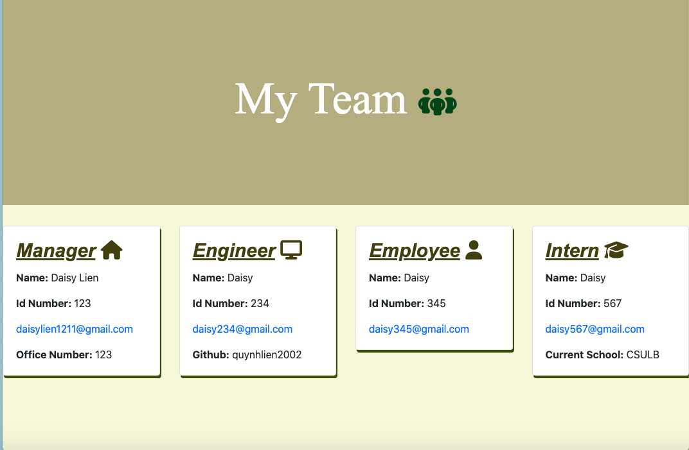
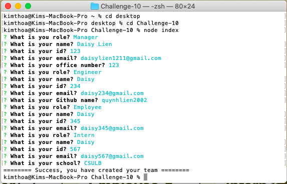

# Challenge-10
Team Generate 

## Challenge
In the challenge for week 10, we will make a website from scratch using node.js to create a website that can add a team members in a team. 

## User Story 
As a user, I want to have a place where I can create my team at my workplace so it is easier for me to know who is in my team, their information and how to contact them. 

## The Logic
GIVEN a command-line application that accepts user input
WHEN I am prompted for my team members and their information
THEN an HTML file is generated that displays a nicely formatted team roster based on user input
WHEN I click on an email address in the HTML
THEN my default email program opens and populates the TO field of the email with the address
WHEN I click on the GitHub username
THEN that GitHub profile opens in a new tab
WHEN I start the application
THEN I am prompted to enter the team manager’s name, employee ID, email address, and office number
WHEN I enter the team manager’s name, employee ID, email address, and office number
THEN I am presented with a menu with the option to add an engineer or an intern or to finish building my team
WHEN I select the engineer option
THEN I am prompted to enter the engineer’s name, ID, email, and GitHub username, and I am taken back to the menu
WHEN I select the intern option
THEN I am prompted to enter the intern’s name, ID, email, and school, and I am taken back to the menu
WHEN I decide to finish building my team
THEN I exit the application, and the HTML is generated

## How to get to the terminal?
When clone the repo, you should open your terminal on Mac or gitbash on Window, then do 'ls' to see where the folder located. Then you can use 'cd "name-of-repo" ' so it can guide you to the repo. When your code is shown somewhat like this "kimthoa@Kims-MacBook-Pro desktop % " , then you can start type in "node index.js".

## How the web look?

## How the code look?

## Video Walkthrough

